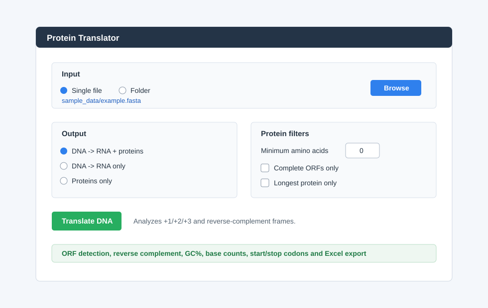
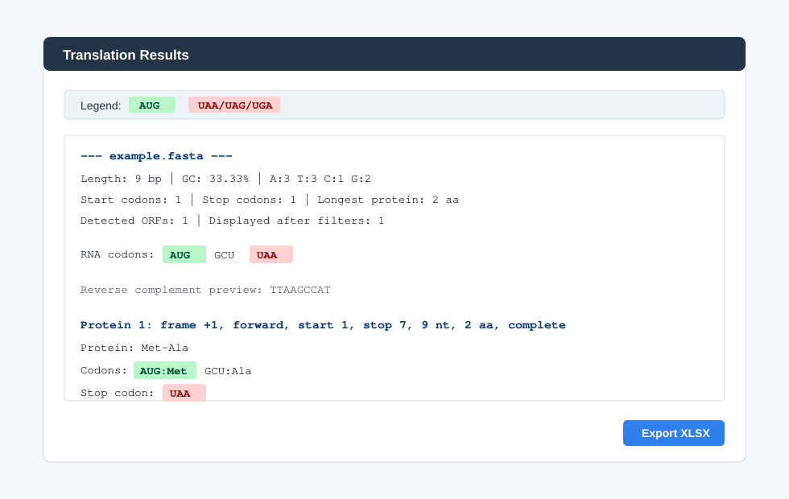

# DNA -> RNA & Protein Translator (Python)

A simple Python application that translates DNA sequences into RNA and proteins.

The program can process a single file or multiple files from a folder. It supports `.txt`, `.csv`, `.fasta`, and `.fa` files, highlights start and stop codons in the GUI, detects ORFs, calculates biological statistics, and allows exporting results to Excel.

---

## Screenshots

Main application window:



Results window:



---

## Features

- Translate DNA sequences to RNA and proteins
- Support for `.txt`, `.csv`, `.fasta`, and `.fa` file formats
- Automatic DNA cleaning and validation
- RNA transcription
- Protein translation starting from AUG codon to stop codons (UAA, UAG, UGA)
- Detect ORFs in all reading frames:
  - frame +1, +2, +3
  - reverse complement frames -1, -2, -3
- Reverse complement analysis
- Biological statistics:
  - sequence length
  - GC percentage
  - A/T/C/G base count
  - start codon count
  - stop codon count
  - longest protein length
- Protein filtering:
  - minimum amino acid length
  - complete ORFs only
  - longest protein only
- Simple graph tab in the GUI for codons, GC distribution, and protein lengths
- Start and stop codons highlighted in the GUI
- Export results to Excel
- Processes multiple files in parallel for faster execution
- Unit tests with `pytest`

---

## Technologies Used

- Python 3.10+
- Tkinter (GUI)
- openpyxl (Excel export)
- pytest (unit testing)
- functools (LRU cache)
- concurrent.futures (parallel processing)

---

## Installation

```bash
pip install -r requirements.txt
```
---

## Project Structure

The project folder contains:

- `dna_protein_translator.py` - Main program used to start the GUI or CLI
- `codon_table.py` - Codon-to-amino acid mapping
- `translator/dna_utils.py` - DNA cleaning, validation, transcription, complement, reverse complement, GC content
- `translator/protein_translation.py` - Protein translation and ORF detection
- `translator/analysis.py` - Biological statistics
- `translator/export.py` - Excel export
- `translator/gui.py` - Tkinter interface
- `translator/cli.py` - Terminal interface
- `tests/` - Unit tests
- `sample_data/` - Example FASTA files
- `docs/screenshots/` - README images
- `example_output/` - Example Excel output

---

## How to Run the Application

1. Open Terminal.

2. Go to the project folder:

```bash
cd Protein-translator
```

3. Install the required packages:

```bash
python3 -m pip install -r requirements.txt
```

4. Start the GUI:

```bash
python3 dna_protein_translator.py
```

5. In the application:

- Choose `Single file` or `Folder`
- Click `Browse`
- Select a `.txt`, `.csv`, `.fasta`, or `.fa` file
- Choose the translation type
- Optionally set protein filters
- Click `Translate DNA`
- View the results
- Export to Excel if needed

Important: on macOS, use `python3`, not `python`.

---

## CLI Usage

The project can also be run from the terminal.

Analyze one FASTA file:

```bash
python3 dna_protein_translator.py --input sample_data/example.fasta
```

Analyze one FASTA file and export the results:

```bash
python3 dna_protein_translator.py --input sample_data/example.fasta --export results.xlsx
```

Analyze a folder:

```bash
python3 dna_protein_translator.py --input sample_data --folder
```

Analyze only complete ORFs with at least 50 amino acids:

```bash
python3 dna_protein_translator.py --input sample_data --folder --complete --min-aa 50
```

Show only the longest protein:

```bash
python3 dna_protein_translator.py --input sample_data --folder --longest
```

---

## How the Program Works

1. User selects input type:
   - Single File
   - Folder
2. The program reads the sequences:
   - For FASTA files, lines starting with `>` are ignored
   - DNA sequences are cleaned and validated
3. DNA is transcribed to RNA
4. The reverse complement is calculated
5. ORFs are detected in all forward and reverse reading frames
6. Biological statistics are calculated
7. Results are displayed in a scrollable window with start/stop codons highlighted
8. Results can be exported to Excel

---

## Example Input / Output

Input DNA:

```text
ATGGCTTAA
```

RNA:

```text
AUGGCUUAA
```

Detected ORF:

```text
Frame: +1
Start position: 1
Stop position: 7
ORF length: 9
Protein: Met-Ala
Stop codon: UAA
```

---

## Excel Export
The exported `.xlsx` file contains:
- RNA – transcribed RNA sequence
- Protein – translated protein sequence
- Codon:Aminoacid – codons and their corresponding amino acids
- Stop Codon – detected stop codon, if present

The exported `.xlsx` file contains:

- Summary information for each file
- RNA sequence
- Complement DNA
- Reverse complement DNA
- ORF frame
- Start position
- Stop position
- ORF length
- Protein length
- Protein sequence
- Stop codon
- GC percentage
- Codon:Aminoacid mapping

---

## Unit Tests

Run tests with:

```bash
python3 -m pytest
```

The tests cover:

- DNA -> RNA transcription
- DNA validation
- Codon translation
- Reverse complement
- GC content
- ORF detection
- Protein filtering

---

## Short Biological Explanation

A codon is a group of three RNA bases that codes for an amino acid.

`AUG` is the start codon and usually codes for Methionine (`Met`).

`UAA`, `UAG`, and `UGA` are stop codons. They mark the end of a protein sequence.

An ORF (Open Reading Frame) is a possible protein-coding region. This application searches for ORFs on both the original DNA strand and the reverse complement strand.

---

## Test Files / Credits

The FASTA sequences used for testing were downloaded from NCBI:

- Homo sapiens chromosome 17, clone hRPK.1053_B_8, complete sequence  
  NCBI link: https://www.ncbi.nlm.nih.gov/nuccore/AC006083.1?report=fasta

- Homo sapiens chromosome 1 clone VMRC53-215D14, complete sequence  
  NCBI link: https://www.ncbi.nlm.nih.gov/nuccore/AC278876.1?report=fasta

These files were used solely for testing and demonstration purposes.

---

## Possible Improvements

- Support ambiguous DNA bases
- Add FASTA export for detected proteins
- Add codon usage charts
- Add alternative genetic codes
- Add more advanced GUI visualizations

---

---

## Author

Alexandra-Maria Blaga
Computer Science Student


## Licence

This project is for educational purposes.
